# Kubernetes Nginx Rollout Lab

This repository documents a hands-on Kubernetes portfolio project using Minikube, Nginx, Deployment, Service, ConfigMap, scaling, rollout update, rollback, logs, and endpoint verification.

The goal of this project is to practice basic Kubernetes application deployment and troubleshooting in a local lab environment.

---

## Project Summary

In this lab, I deployed a custom Nginx web page on a local Kubernetes cluster using Minikube.

The application is managed using Kubernetes YAML manifests stored in the `k8s/` directory.

This project demonstrates:

- Creating a Kubernetes namespace
- Creating a ConfigMap for a custom `index.html`
- Deploying Nginx using a Kubernetes Deployment
- Exposing the application using a Kubernetes Service
- Accessing the application through Minikube
- Testing service response using `curl`
- Scaling replicas
- Performing rollout update
- Performing rollback
- Checking logs and endpoints
- Documenting the project with screenshots

---

## Tools Used

- Ubuntu / Linux Terminal
- Minikube
- Kubernetes
- kubectl
- Nginx
- Git
- GitHub

---

## Project Structure

```text
k8s-nginx-rollout/
├── k8s/
│   ├── configmap.yaml
│   ├── deployment.yaml
│   ├── namespace.yaml
│   └── service.yaml
├── screenshots/
│   ├── 01-project-folder-created.png
│   ├── 02-minikube-node-ready.png
│   ├── 03-namspace-yaml.png
│   ├── 04-configmap-yaml.png
│   ├── 05-deployment-yaml.png
│   ├── 06-service-yaml.png
│   ├── 07-kubectl-apply-success.png
│   ├── 08-kubectl-get-all-wide.png
│   ├── 09-describe-deployment-service.png
│   ├── 10-minikube-service-url.png
│   ├── 11-curl-service-response-.png
│   ├── 12-scale-to-4-replicas.png
│   ├── 13-rollout-updates-success.png
│   ├── 14-rollout-history.png
│   ├── 15-rollout-rollback-success.png
│   ├── 16-logs-and-endpoints.png
│   └── 17-git-initial-commit.png
└── README.md
```

---

## Kubernetes Resources

This project uses the following Kubernetes resources:

| Resource | Purpose |
|---|---|
| Namespace | Isolates the project resources from the default namespace |
| ConfigMap | Stores the custom Nginx `index.html` page |
| Deployment | Manages the Nginx pods and replicas |
| Service | Exposes the Nginx application |
| Pods | Run the Nginx containers |
| ReplicaSet | Maintains the desired number of pod replicas |

---

## Namespace

The namespace is used to isolate all resources for this project.

Command:

```bash
kubectl apply -f k8s/namespace.yaml
```

Verification:

```bash
kubectl get namespace
```

Expected namespace:

```text
portfolio-lab
```

---

## ConfigMap

The ConfigMap stores a custom HTML page that is mounted into the Nginx container.

Command:

```bash
kubectl apply -f k8s/configmap.yaml
```

Verification:

```bash
kubectl get configmap -n portfolio-lab
kubectl describe configmap nginx-index-html -n portfolio-lab
```

The ConfigMap is mounted into the container path:

```text
/usr/share/nginx/html/index.html
```

This replaces the default Nginx page with a custom portfolio lab page.

---

## Deployment

The Deployment manages the Nginx application pods.

Command:

```bash
kubectl apply -f k8s/deployment.yaml
```

Verification:

```bash
kubectl get deployment -n portfolio-lab
kubectl get pods -n portfolio-lab -o wide
kubectl describe deployment nginx-deployment -n portfolio-lab
```

The Deployment includes:

- Nginx image
- 2 replicas
- ConfigMap volume mount
- Readiness probe
- Liveness probe
- Rolling update strategy

Example healthy Deployment condition:

```text
2 desired | 2 updated | 2 total | 2 available | 0 unavailable
```

This means the Deployment is running successfully.

---

## Service

The Service exposes the Nginx Deployment so the application can be accessed.

Command:

```bash
kubectl apply -f k8s/service.yaml
```

Verification:

```bash
kubectl get service -n portfolio-lab
```

Access using Minikube:

```bash
minikube service nginx-service -n portfolio-lab
```

Alternative access using port-forward:

```bash
kubectl port-forward service/nginx-service 8080:80 -n portfolio-lab
```

Then open in browser:

```text
http://127.0.0.1:8080
```

Or test using curl:

```bash
curl http://127.0.0.1:8080
```

---

## Important Note About Minikube Service URL

When using Minikube with Docker driver on Linux, the service tunnel may require the terminal to stay open.

Example message:

```text
Because you are using a Docker driver on linux, the terminal needs to be open to run it.
```

This means the localhost tunnel URL may stop working when the terminal is closed.

For more stable local testing, this command can be used:

```bash
kubectl port-forward service/nginx-service 8080:80 -n portfolio-lab
```

---

## Scaling Test

The Deployment was scaled to test how Kubernetes manages multiple replicas.

Example command:

```bash
kubectl scale deployment nginx-deployment --replicas=4 -n portfolio-lab
```

Verification:

```bash
kubectl get pods -n portfolio-lab
kubectl get deployment -n portfolio-lab
```

Scaling helps verify that Kubernetes can increase or decrease the number of running application pods based on the desired replica count.

---

## Rollout Update

Kubernetes rollout allows us to update an application version in a controlled way.

Example command:

```bash
kubectl set image deployment/nginx-deployment nginx=nginx:1.26 -n portfolio-lab
```

Add change cause annotation:

```bash
kubectl annotate deployment nginx-deployment \
  kubernetes.io/change-cause="Update nginx image from 1.25 to 1.26" \
  -n portfolio-lab --overwrite
```

Check rollout status:

```bash
kubectl rollout status deployment/nginx-deployment -n portfolio-lab
```

Check rollout history:

```bash
kubectl rollout history deployment/nginx-deployment -n portfolio-lab
```

---

## Rollback Test

Rollback is used to return the Deployment to a previous stable revision.

Command:

```bash
kubectl rollout undo deployment/nginx-deployment -n portfolio-lab
```

Verification:

```bash
kubectl rollout status deployment/nginx-deployment -n portfolio-lab
kubectl rollout history deployment/nginx-deployment -n portfolio-lab
```

Example successful output:

```text
deployment "nginx-deployment" successfully rolled out
```

This means the rollback was successful and the Deployment returned to a stable state.

---

## Logs and Endpoint Verification

Check pod logs:

```bash
kubectl logs <pod-name> -n portfolio-lab
```

Check endpoints:

```bash
kubectl get endpoints -n portfolio-lab
```

Check all resources:

```bash
kubectl get all -n portfolio-lab -o wide
```

These commands are useful for troubleshooting whether the Service is connected to the correct Pods.

---

## Main Commands Used

```bash
kubectl apply -f k8s/namespace.yaml
kubectl apply -f k8s/configmap.yaml
kubectl apply -f k8s/deployment.yaml
kubectl apply -f k8s/service.yaml

kubectl get all -n portfolio-lab -o wide
kubectl get pods -n portfolio-lab -o wide
kubectl get service -n portfolio-lab
kubectl get endpoints -n portfolio-lab

kubectl describe deployment nginx-deployment -n portfolio-lab
kubectl describe service nginx-service -n portfolio-lab

minikube service nginx-service -n portfolio-lab
kubectl port-forward service/nginx-service 8080:80 -n portfolio-lab

kubectl scale deployment nginx-deployment --replicas=4 -n portfolio-lab

kubectl rollout status deployment/nginx-deployment -n portfolio-lab
kubectl rollout history deployment/nginx-deployment -n portfolio-lab
kubectl rollout undo deployment/nginx-deployment -n portfolio-lab

kubectl logs <pod-name> -n portfolio-lab
```

---

## Screenshots

### 1. Project folder created

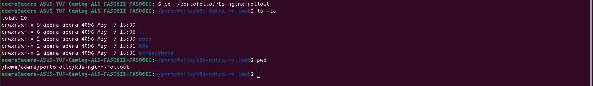

### 2. Minikube node ready

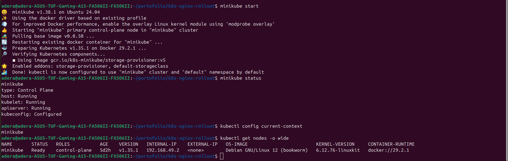

### 3. Namespace YAML

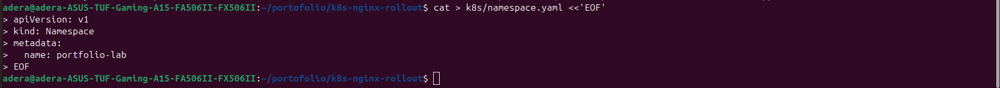

### 4. ConfigMap YAML

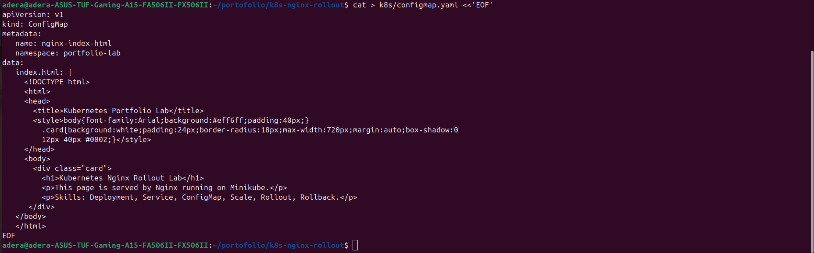

### 5. Deployment YAML

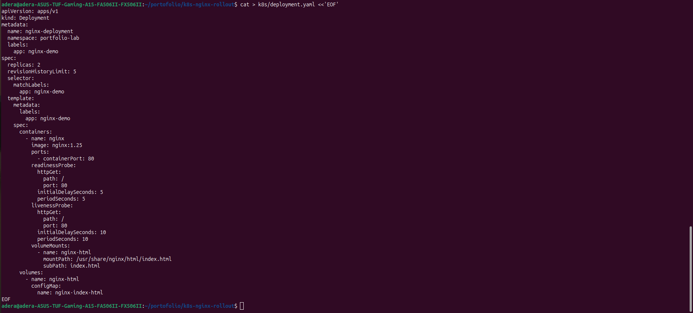

### 6. Service YAML

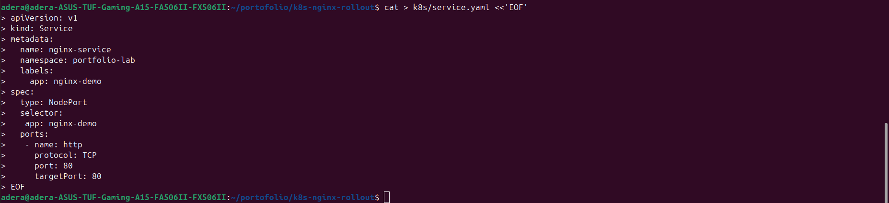

### 7. Kubernetes apply success

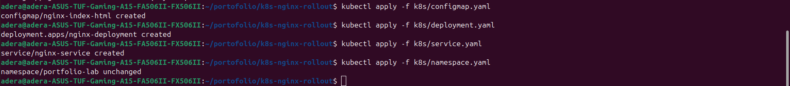

### 8. Kubernetes resources running

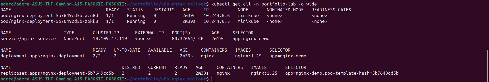

### 9. Deployment and Service description


### 10. Minikube service URL

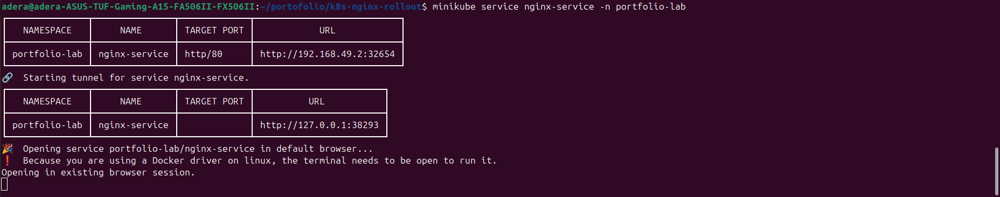

### 11. Curl service response

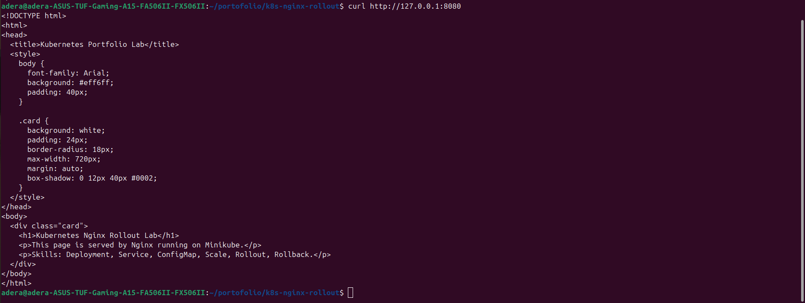

### 12. Scaling to 4 replicas

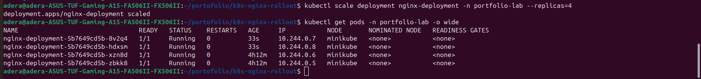

### 13. Rollout update success

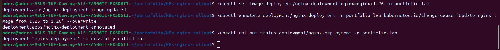

### 14. Rollout history

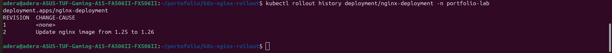

### 15. Rollback success

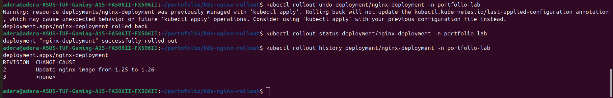

### 16. Logs and endpoints

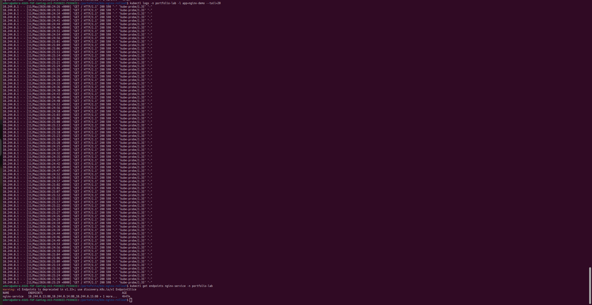

### 17. Git initial commit

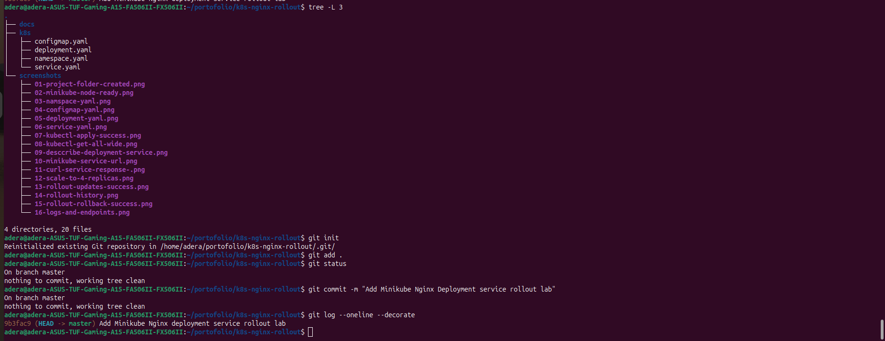

---

## What I Learned

From this project, I learned how Kubernetes manages application deployment using declarative YAML manifests.

I practiced how to:

- Create Kubernetes resources using YAML
- Use Namespace to isolate resources
- Use ConfigMap to inject custom HTML content into Nginx
- Deploy an application using Deployment
- Expose an application using Service
- Verify running Pods and Services
- Scale application replicas
- Perform rollout update
- Perform rollback to a previous stable version
- Check logs and endpoints for troubleshooting

This project helped me understand important Cloud Engineering skills such as deployment management, application exposure, health checking, scaling, rollback strategy, and Kubernetes troubleshooting.

---

## Cleanup

To remove all resources created in this lab:

```bash
kubectl delete namespace portfolio-lab
```

This command deletes the namespace and all Kubernetes resources inside it.

---

## Repository Purpose

This repository is part of my Cloud Engineering learning portfolio.

It shows my hands-on practice with Kubernetes, Minikube, Nginx, Deployment, Service, ConfigMap, rollout, rollback, scaling, logs, endpoints, and GitHub documentation.
